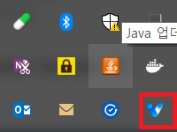

# Tray

## javascript file
```js
const electron = require("electron");

const app = electron.app;
...

const Tray = electron.Tray;
const iconPath = path.join(__dirname, "static\\liveen-logo.png");

let win;

app.on("ready", function() {
  new Tray(iconPath);
});

app.on("window-all-closed", () => {
  if (process.platform !== "darwin") {
    app.quit();
  }
});

app.on("activate", () => {
  if (win === null) {
  }
});

```

## result


